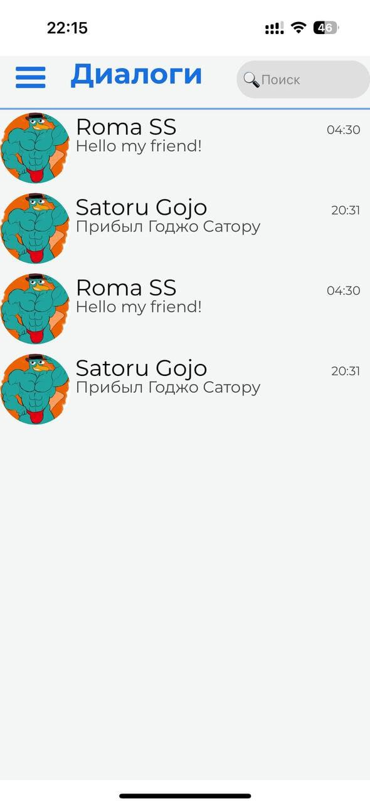
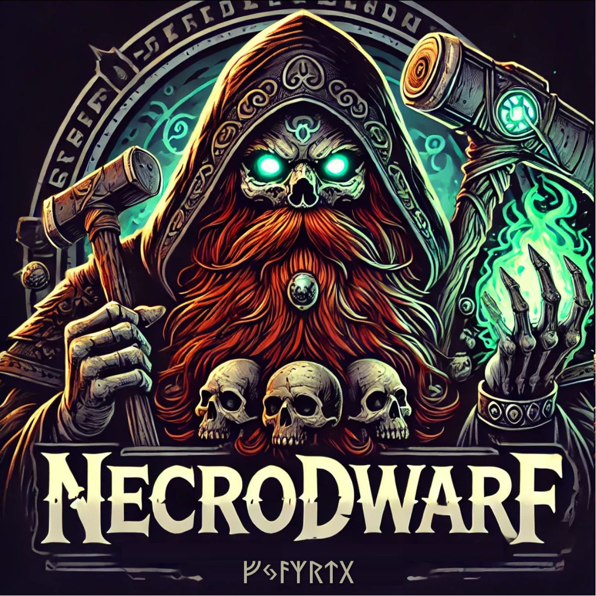

# Vkgramm

<div id="header" align="center">
   
</div>
##📌 Описание

Vkgramm — это современный мессенджер, разработанный командой **Necrodwarf**. Проект включает в себя серверную часть, вебсокет-сервер, сервис верификации почты и клиентское приложение.

## 🚀 Основные функции

- 🔹 Регистрация и аутентификация пользователей
- 🔹 Отправка текстовых сообщений и файлов
- 🔹 Верификация email
- 🔹 Вебсокет-сервер для мгновенных обновлений

## 🛠️ Технологии

Проект использует следующие технологии:

- **Backend:** Node.js, Express, MongoDB
- **Backend WebSocket:** WebSocket API
- **Verification API:** Express, Nodemailer
- **Client:** React Native

## 📂 Структура репозитория

```
Vkgramm/
│── backend/          # Основной сервер
│── backendWs/        # WebSocket-сервер
│── verification_api/ # API для верификации email
│── Messenger/        # Клиентское приложение
```

## 🔧 Установка и запуск

1. **Клонировать репозиторий:**
   
   ```sh
   git clone https://github.com/your-repo/vkgramm.git
   cd vkgramm
   ```

2. **Установить зависимости:**
   
   ```sh
   cd backend && npm install
   cd ../backendWs && npm install
   cd ../verification_api && npm install
   cd ../Messenger && npm install
   ```

3. **Запуск серверов:**
   
   ```sh
   cd backend && npm start
   cd ../backendWs && npm start
   cd ../verification_api && npm start
   ```

4. **Запуск клиента:**
   
   ```sh
   cd Messenger && npx expo start
   ```

## 📸 Скриншоты
<div id="header" align="center">



</div>
##🏗️ Разработчики

- **Necrodwarf Team**
  
<div id="header" align="center">
  
</div>
##📬 Контакты

✉️ [kabanchikov.adventure@gmail.com](mailto:kabanchikov.adventure@gmail.com) | 🌐 [Website](https://your-website.com/)

---

⭐ Если вам понравился проект, поставьте звезду на GitHub!
